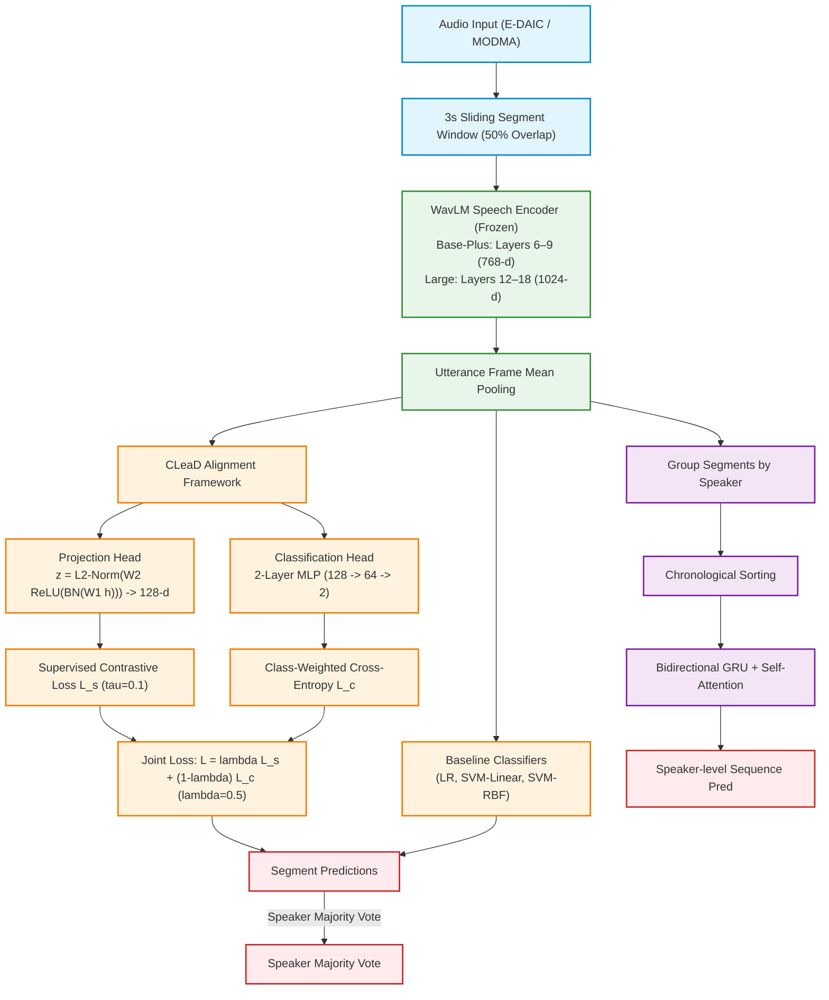

# Layer-wise Cross-Lingual Depression Detection from Speech: Analysis with Contrastive Alignment

This repository contains the codebase for cross-lingual zero-shot depression detection from speech, specifically targeting the transfer gap between Germanic (English) and Tonal (Mandarin) languages. We perform a multi-layer evaluation using both `microsoft/wavlm-base-plus` and `microsoft/wavlm-large` speech encoders paired with supervised contrastive alignment (CLeaD).

## Master Pipeline Structure



## Component Overview
1. **Feature Extractor:** We compare `microsoft/wavlm-base-plus` (using layers 6, 7, 8, 9) and `microsoft/wavlm-large` (using layers 12, 14, 16, 18) to extract robust speech representations.
2. **CLeaD (Contrastive Alignment):** A dual-head architecture using Supervised Contrastive Loss (SupCon) to align same-class representations across English and Mandarin domains into a shared manifold.
3. **Non-Linear Classifier (SVM-RBF):** Radial Basis Function SVM is applied to standardized segment embeddings to capture non-linear decision boundaries.
4. **Sequence Modeling (Bi-GRU):** Groups segment embeddings per speaker and feeds them to a bidirectional GRU with self-attention pooling to capture temporal trajectories.

## Datasets
* **E-DAIC:** English corpus used for baseline training and evaluation.
* **MODMA:** Mandarin corpus used to validate zero-shot cross-lingual alignment.
  > [!NOTE]
  > **Citation Correction**: The MODMA dataset (*MODMA dataset: a Multi-modal Open Dataset for Mental-disorder Analysis*) should be cited in text as **Cai et al. (2020)** based on the first author Hanshu Cai, correcting the mismatch with "Sun et al." in previous drafts.

## Reproducibility & Speaker-Independent Splits

To prevent **Speaker Identity Leakage**, all recording segments from a given speaker are kept strictly within a single partition (Train, Validation, or Test) using `StratifiedGroupKFold(n_splits=5, shuffle=True, random_state=42)`.

* **Fixed Process Random Seed:** A single fixed seed of **`42`** is set across all operations (`np.random.seed(42)` and `torch.manual_seed(42)`).
* **Static Split Reuse:** The speaker partitions are computed once and saved as static CSV files (`data/utterance_table_edaic_segmented_split.csv` and `data/utterance_table_modma_segmented_split.csv`). Every single run out of the 240 evaluation runs reuses these identical split files.
* **Canonical Speaker ID Lists:**
  * **E-DAIC Corpus (122 Participants Total, 75/24/23 Split):**
    * **Train (75 speakers):** `300, 302, 306, 307, 311, 312, 313, 317, 318, 319, 321, 323, 325, 326, 327, 328, 329, 330, 331, 332, 334, 336, 338, 339, 341, 344, 345, 346, 347, 350, 355, 356, 358, 360, 361, 362, 365, 366, 367, 368, 371, 372, 373, 375, 376, 377, 378, 379, 382, 383, 384, 385, 386, 387, 388, 392, 393, 395, 397, 401, 403, 406, 408, 411, 413, 414, 415, 416, 417, 418, 419, 421, 422, 423, 424`
    * **Validation (24 speakers):** `303, 305, 308, 310, 314, 316, 320, 322, 351, 352, 353, 354, 357, 359, 369, 370, 381, 396, 399, 407, 409, 412, 420, 425`
    * **Test (23 speakers):** `301, 304, 309, 315, 324, 333, 335, 340, 343, 348, 349, 363, 364, 374, 380, 389, 390, 391, 400, 402, 404, 405, 410`
  * **MODMA Corpus (52 Participants Total, 31/11/10 Split):**
    * **Train (31 speakers):** `02010001, 02010002, 02010003, 02010004, 02010005, 02010009, 02010012, 02010023, 02010024, 02010025, 02010034, 02010036, 02010037, 02020004, 02020007, 02020010, 02020011, 02020016, 02020018, 02020021, 02020022, 02020026, 02030001, 02030004, 02030005, 02030006, 02030008, 02030009, 02030010, 02030015, 02030017`
    * **Validation (11 speakers):** `02010010, 02010011, 02010014, 02010018, 02010039, 02020014, 02020023, 02020027, 02030002, 02030007, 02030016`
    * **Test (10 speakers):** `02010006, 02010008, 02010013, 02010015, 02010022, 02020008, 02020015, 02020019, 02020025, 02030014`

---

## How to Run the Pipeline

### 1. Unified Scripts
For convenience, you can execute the entire pipeline or only the downstream classification using the provided shell scripts from the repository root:
```bash
# 1. Run the full pipeline (including feature extraction for both model variants)
./code/run_full_pipeline.sh

# 2. Run the classification and evaluation only (if features are already extracted)
./code/run_classification_only.sh
```

### 2. Manual Preprocessing
To segment the audio datasets into 10-second sliding windows and build mixed domain tables manually:
```bash
# 1. Segment and split EDAIC
python3 code/preprocessing/segment_edaic_sliding.py
python3 code/preprocessing/split_metadata.py --input_csv data/utterance_table_edaic_segmented.csv

# 2. Segment and split MODMA
python3 code/preprocessing/segment_modma_sliding.py
python3 code/preprocessing/split_metadata.py --input_csv data/utterance_table_modma_segmented.csv

# 3. Combine them to create the MIX dataset metadata
python3 code/preprocessing/build_mixed_metadata.py
```

### 3. Manual Feature Extraction
Extract pooling features for a specific model variant:
```bash
# Extract WavLM Base-Plus features (Layers 6, 7, 8, 9)
python3 code/feature_extraction/extract_ablation_features.py --model base-plus --device auto

# Extract WavLM Large features (Layers 12, 14, 16, 18)
python3 code/feature_extraction/extract_ablation_features.py --model large --device auto
```

### 4. Manual Downstream Ablation Study & Comparison
Train and evaluate LR, SVM-Linear, SVM-RBF, Bi-GRU, and CLeaD classifiers:
```bash
# Run ablation study on Base-Plus features
python3 code/classification/run_comprehensive_ablation.py --model base-plus

# Run ablation study on Large features
python3 code/classification/run_comprehensive_ablation.py --model large

# Generate comparison report
python3 code/classification/compare_results.py
```

### 5. Reviewer-Requested Experiments & Analysis (Optional)
To run the additional experiments requested by reviewers (leakage study, CLeaD hyperparameter sweep, and domain alignment visualization):
```bash
# 1. Run the within-pipeline leakage ablation study
python3 code/classification/run_leakage_ablation.py

# 2. Run the quantitative t-SNE domain alignment analysis
python3 code/classification/quantify_tsne_alignment.py

# 3. Generate the t-SNE projection visualization plots
python3 code/classification/plot_tsne_projections.py

# 4. Run the CLeaD hyperparameter temperature and lambda sweep
python3 code/classification/run_hyperparameter_sweep.py
```

---

## Results & Performance Scores

## 1. Zero-Shot Cross-Lingual Transfer
Zero-shot cross-lingual transfer tests the model's ability to generalize to a completely unseen language (e.g. English trained model evaluated on Mandarin segments and vice versa).

### Configuration: EN -> ZH
| Layers | Model | Base-Plus Acc | Large Acc | Base-Plus F1 | Large F1 | Base Speaker Acc | Large Speaker Acc |
| :---: | :--- | :---: | :---: | :---: | :---: | :---: | :---: |
| L6 / L12 | LR | 49.79% | 44.90% (-4.9%) | 0.2134 | 0.1213 (-0.092) | 50.0% | 50.0% |
| L6 / L12 | SVM-Linear | 49.46% | 46.28% (-3.2%) | 0.2361 | 0.0599 (-0.176) | 50.0% | 50.0% |
| L6 / L12 | SVM-RBF | 49.00% | 48.04% (-1.0%) | 0.2004 | 0.0296 (-0.171) | 50.0% | 50.0% |
| L6 / L12 | GRU | 50.00% | **60.00%** (+10.0%) | 0.5455 | **0.7143** (+0.169) | 50.0% | **60.0%** (+10.0%) |
| L6 / L12 | CLeaD | 49.08% | 47.70% (-1.4%) | 0.3321 | 0.0280 (-0.304) | 60.0% | 50.0% (-10.0%) |
| L7 / L14 | LR | 52.26% | 41.90% (-10.4%) | 0.2650 | 0.0926 (-0.172) | 50.0% | 50.0% |
| L7 / L14 | SVM-Linear | 50.04% | 44.28% (-5.8%) | 0.2323 | 0.0485 (-0.184) | 50.0% | 50.0% |
| L7 / L14 | SVM-RBF | 52.55% | 48.16% (-4.4%) | 0.6558 | 0.0267 (-0.629) | 50.0% | 50.0% |
| L7 / L14 | GRU | 50.00% | **60.00%** (+10.0%) | 0.5455 | **0.7143** (+0.169) | 50.0% | **60.0%** (+10.0%) |
| L7 / L14 | CLeaD | 48.20% | 47.91% (-0.3%) | 0.2031 | 0.0851 (-0.118) | 50.0% | 50.0% |
| L8 / L16 | LR | 50.00% | 44.78% (-5.2%) | 0.2723 | 0.0664 (-0.206) | 50.0% | 50.0% |
| L8 / L16 | SVM-Linear | 49.96% | 45.82% (-4.1%) | 0.2437 | 0.0581 (-0.186) | 50.0% | 50.0% |
| L8 / L16 | SVM-RBF | 53.34% | 47.49% (-5.8%) | 0.2962 | 0.0499 (-0.246) | 50.0% | 50.0% |
| L8 / L16 | GRU | 60.00% | 50.00% (-10.0%) | 0.6000 | **0.6154** (+0.015) | 60.0% | 50.0% (-10.0%) |
| L8 / L16 | CLeaD | 49.25% | 48.54% (-0.7%) | 0.3101 | 0.0595 (-0.251) | 50.0% | 50.0% |
| L9 / L18 | LR | 49.04% | 44.36% (-4.7%) | 0.2259 | 0.1024 (-0.123) | 50.0% | 50.0% |
| L9 / L18 | SVM-Linear | 49.04% | 45.86% (-3.2%) | 0.1899 | 0.0703 (-0.120) | 50.0% | 50.0% |
| L9 / L18 | SVM-RBF | 51.84% | 47.20% (-4.6%) | 0.6755 | 0.0733 (-0.602) | 50.0% | 50.0% |
| L9 / L18 | GRU | 60.00% | 50.00% (-10.0%) | 0.5000 | **0.5455** (+0.045) | 60.0% | 50.0% (-10.0%) |
| L9 / L18 | CLeaD | 46.53% | **48.41%** (+1.9%) | 0.3074 | 0.1394 (-0.168) | 50.0% | 50.0% |

### Configuration: ZH -> EN
| Layers | Model | Base-Plus Acc | Large Acc | Base-Plus F1 | Large F1 | Base Speaker Acc | Large Speaker Acc |
| :---: | :--- | :---: | :---: | :---: | :---: | :---: | :---: |
| L6 / L12 | LR | 56.32% | 50.81% (-5.5%) | 0.4080 | **0.5209** (+0.113) | N/A | N/A |
| L6 / L12 | SVM-Linear | 57.10% | 52.52% (-4.6%) | 0.4197 | **0.4745** (+0.055) | N/A | N/A |
| L6 / L12 | SVM-RBF | 55.17% | 50.45% (-4.7%) | 0.3696 | 0.2553 (-0.114) | N/A | N/A |
| L6 / L12 | GRU | 60.87% | 56.52% (-4.3%) | 0.1818 | 0.0000 (-0.182) | 60.9% | 56.5% (-4.3%) |
| L6 / L12 | CLeaD | 60.91% | 52.25% (-8.7%) | 0.5045 | 0.3879 (-0.117) | N/A | N/A |
| L7 / L14 | LR | 55.02% | 50.65% (-4.4%) | 0.3915 | **0.4172** (+0.026) | N/A | N/A |
| L7 / L14 | SVM-Linear | 55.26% | 50.05% (-5.2%) | 0.3988 | **0.4221** (+0.023) | N/A | N/A |
| L7 / L14 | SVM-RBF | 56.42% | 52.50% (-3.9%) | 0.3949 | **0.4071** (+0.012) | N/A | N/A |
| L7 / L14 | GRU | 65.22% | 65.22% | 0.3333 | 0.0000 (-0.333) | 65.2% | 65.2% |
| L7 / L14 | CLeaD | 52.88% | 49.21% (-3.7%) | 0.3544 | **0.4059** (+0.052) | N/A | N/A |
| L8 / L16 | LR | 54.97% | 50.25% (-4.7%) | 0.3904 | **0.4449** (+0.054) | N/A | N/A |
| L8 / L16 | SVM-Linear | 54.90% | 48.84% (-6.1%) | 0.3862 | **0.4103** (+0.024) | N/A | N/A |
| L8 / L16 | SVM-RBF | 57.02% | 52.50% (-4.5%) | 0.4213 | 0.3938 (-0.027) | N/A | N/A |
| L8 / L16 | GRU | 65.22% | 65.22% | 0.0000 | 0.0000 | 65.2% | 65.2% |
| L8 / L16 | CLeaD | 53.29% | 48.23% (-5.1%) | 0.3707 | 0.3557 (-0.015) | N/A | N/A |
| L9 / L18 | LR | 53.61% | 49.14% (-4.5%) | 0.3456 | **0.4290** (+0.083) | N/A | N/A |
| L9 / L18 | SVM-Linear | 54.78% | 49.35% (-5.4%) | 0.3922 | **0.4292** (+0.037) | N/A | N/A |
| L9 / L18 | SVM-RBF | 58.77% | 51.99% (-6.8%) | 0.4359 | 0.4035 (-0.032) | N/A | N/A |
| L9 / L18 | GRU | 69.57% | 69.57% | 0.0000 | **0.2222** (+0.222) | 69.6% | 69.6% |
| L9 / L18 | CLeaD | 57.30% | 49.47% (-7.8%) | 0.4412 | **0.4774** (+0.036) | N/A | N/A |

## 2. Monolingual Baselines
Monolingual configurations train and test on the same language/domain to establish performance upper bounds.

### Configuration: EN -> EN
| Layers | Model | Base-Plus Acc | Large Acc | Base-Plus F1 | Large F1 | Base Speaker Acc | Large Speaker Acc |
| :---: | :--- | :---: | :---: | :---: | :---: | :---: | :---: |
| L6 / L12 | LR | 71.47% | **71.51%** (+0.0%) | 0.6384 | **0.6441** (+0.006) | N/A | N/A |
| L6 / L12 | SVM-Linear | 72.30% | **73.99%** (+1.7%) | 0.6591 | **0.6791** (+0.020) | N/A | N/A |
| L6 / L12 | SVM-RBF | 68.54% | **75.46%** (+6.9%) | 0.5508 | **0.6020** (+0.051) | N/A | N/A |
| L6 / L12 | GRU | 69.57% | 56.52% (-13.0%) | 0.5882 | 0.3750 (-0.213) | 69.6% | 56.5% (-13.0%) |
| L6 / L12 | CLeaD | 70.70% | **76.97%** (+6.3%) | 0.6366 | 0.6215 (-0.015) | N/A | N/A |
| L7 / L14 | LR | 69.65% | **73.28%** (+3.6%) | 0.6238 | **0.6596** (+0.036) | N/A | N/A |
| L7 / L14 | SVM-Linear | 69.02% | **73.08%** (+4.1%) | 0.6305 | **0.6635** (+0.033) | N/A | N/A |
| L7 / L14 | SVM-RBF | 39.32% | **73.71%** (+34.4%) | 0.5382 | **0.5749** (+0.037) | N/A | N/A |
| L7 / L14 | GRU | 65.22% | 56.52% (-8.7%) | 0.5000 | 0.3750 (-0.125) | 65.2% | 56.5% (-8.7%) |
| L7 / L14 | CLeaD | 69.74% | **72.33%** (+2.6%) | 0.6035 | 0.5559 (-0.048) | N/A | N/A |
| L8 / L16 | LR | 68.46% | **71.31%** (+2.8%) | 0.6140 | **0.6251** (+0.011) | N/A | N/A |
| L8 / L16 | SVM-Linear | 68.33% | **71.72%** (+3.4%) | 0.6261 | **0.6445** (+0.018) | N/A | N/A |
| L8 / L16 | SVM-RBF | 65.96% | **72.45%** (+6.5%) | 0.5586 | 0.5574 (-0.001) | N/A | N/A |
| L8 / L16 | GRU | 65.22% | 56.52% (-8.7%) | 0.5000 | 0.3750 (-0.125) | 65.2% | 56.5% (-8.7%) |
| L8 / L16 | CLeaD | 70.22% | **73.86%** (+3.6%) | 0.6057 | 0.5715 (-0.034) | N/A | N/A |
| L9 / L18 | LR | 66.32% | **69.87%** (+3.5%) | 0.6035 | **0.6146** (+0.011) | N/A | N/A |
| L9 / L18 | SVM-Linear | 66.61% | **70.02%** (+3.4%) | 0.6215 | **0.6253** (+0.004) | N/A | N/A |
| L9 / L18 | SVM-RBF | 37.85% | **71.71%** (+33.9%) | 0.5330 | **0.5661** (+0.033) | N/A | N/A |
| L9 / L18 | GRU | 78.26% | 69.57% (-8.7%) | 0.5455 | 0.4615 (-0.084) | 78.3% | 69.6% (-8.7%) |
| L9 / L18 | CLeaD | 67.37% | **72.24%** (+4.9%) | 0.5923 | 0.5751 (-0.017) | N/A | N/A |

### Configuration: ZH -> ZH
| Layers | Model | Base-Plus Acc | Large Acc | Base-Plus F1 | Large F1 | Base Speaker Acc | Large Speaker Acc |
| :---: | :--- | :---: | :---: | :---: | :---: | :---: | :---: |
| L6 / L12 | LR | 53.93% | 49.42% (-4.5%) | 0.4633 | 0.3984 (-0.065) | 70.0% | 60.0% (-10.0%) |
| L6 / L12 | SVM-Linear | 54.85% | 48.08% (-6.8%) | 0.4760 | 0.3819 (-0.094) | 80.0% | 70.0% (-10.0%) |
| L6 / L12 | SVM-RBF | 53.93% | 46.83% (-7.1%) | 0.4558 | 0.3332 (-0.123) | 70.0% | 60.0% (-10.0%) |
| L6 / L12 | GRU | 50.00% | **60.00%** (+10.0%) | 0.2857 | **0.3333** (+0.048) | 50.0% | **60.0%** (+10.0%) |
| L6 / L12 | CLeaD | 57.31% | 50.17% (-7.1%) | 0.5152 | 0.4056 (-0.110) | 70.0% | 70.0% |
| L7 / L14 | LR | 56.10% | 48.71% (-7.4%) | 0.4959 | 0.4062 (-0.090) | 80.0% | 70.0% (-10.0%) |
| L7 / L14 | SVM-Linear | 55.56% | 47.79% (-7.8%) | 0.4904 | 0.3926 (-0.098) | 80.0% | 70.0% (-10.0%) |
| L7 / L14 | SVM-RBF | 53.17% | 45.11% (-8.1%) | 0.4415 | 0.3163 (-0.125) | 70.0% | 50.0% (-20.0%) |
| L7 / L14 | GRU | 40.00% | **60.00%** (+20.0%) | 0.2500 | **0.3333** (+0.083) | 40.0% | **60.0%** (+20.0%) |
| L7 / L14 | CLeaD | 52.42% | 47.28% (-5.1%) | 0.4739 | 0.3862 (-0.088) | 70.0% | 70.0% |
| L8 / L16 | LR | 51.55% | 49.21% (-2.3%) | 0.4528 | 0.3896 (-0.063) | 70.0% | 60.0% (-10.0%) |
| L8 / L16 | SVM-Linear | 51.63% | 48.37% (-3.3%) | 0.4563 | 0.3776 (-0.079) | 80.0% | 60.0% (-20.0%) |
| L8 / L16 | SVM-RBF | 52.92% | 45.61% (-7.3%) | 0.4584 | 0.3226 (-0.136) | 70.0% | 50.0% (-20.0%) |
| L8 / L16 | GRU | 50.00% | **60.00%** (+10.0%) | 0.2857 | **0.3333** (+0.048) | 50.0% | **60.0%** (+10.0%) |
| L8 / L16 | CLeaD | 51.29% | 48.12% (-3.2%) | 0.4859 | 0.3484 (-0.138) | 70.0% | 60.0% (-10.0%) |
| L9 / L18 | LR | 53.47% | 50.67% (-2.8%) | 0.4740 | 0.4110 (-0.063) | 80.0% | 70.0% (-10.0%) |
| L9 / L18 | SVM-Linear | 52.05% | 49.58% (-2.5%) | 0.4564 | 0.3889 (-0.068) | 70.0% | 70.0% |
| L9 / L18 | SVM-RBF | 51.63% | 47.08% (-4.6%) | 0.4417 | 0.3499 (-0.092) | 60.0% | **70.0%** (+10.0%) |
| L9 / L18 | GRU | 40.00% | 40.00% | 0.2500 | 0.2500 | 40.0% | 40.0% |
| L9 / L18 | CLeaD | 52.80% | 46.49% (-6.3%) | 0.5244 | 0.3501 (-0.174) | 80.0% | 70.0% (-10.0%) |

## 3. Mixed-Domain Generalization
Mixed-domain models train on a pooled combination of English and Mandarin speech, then test on monolingual domains to leverage multi-lingual representations.

### Configuration: MIX -> EN
| Layers | Model | Base-Plus Acc | Large Acc | Base-Plus F1 | Large F1 | Base Speaker Acc | Large Speaker Acc |
| :---: | :--- | :---: | :---: | :---: | :---: | :---: | :---: |
| L6 / L12 | LR | 67.40% | **68.74%** (+1.3%) | 0.5673 | **0.5971** (+0.030) | N/A | N/A |
| L6 / L12 | SVM-Linear | 69.35% | **70.65%** (+1.3%) | 0.5963 | **0.6198** (+0.023) | N/A | N/A |
| L6 / L12 | SVM-RBF | 66.24% | **71.13%** (+4.9%) | 0.4816 | **0.5314** (+0.050) | N/A | N/A |
| L6 / L12 | GRU | 60.87% | 26.09% (-34.8%) | 0.4000 | **0.4138** (+0.014) | 60.9% | 26.1% (-34.8%) |
| L6 / L12 | CLeaD | 62.12% | **69.42%** (+7.3%) | 0.4911 | 0.4657 (-0.025) | N/A | N/A |
| L7 / L14 | LR | 66.62% | **66.80%** (+0.2%) | 0.5646 | **0.5722** (+0.008) | N/A | N/A |
| L7 / L14 | SVM-Linear | 69.01% | 67.48% (-1.5%) | 0.6036 | 0.5874 (-0.016) | N/A | N/A |
| L7 / L14 | SVM-RBF | 66.39% | **70.56%** (+4.2%) | 0.5224 | **0.5389** (+0.017) | N/A | N/A |
| L7 / L14 | GRU | 52.17% | 26.09% (-26.1%) | 0.2667 | **0.4138** (+0.147) | 52.2% | 26.1% (-26.1%) |
| L7 / L14 | CLeaD | 63.92% | **67.78%** (+3.9%) | 0.4524 | **0.4564** (+0.004) | N/A | N/A |
| L8 / L16 | LR | 64.44% | 63.79% (-0.6%) | 0.5292 | 0.5192 (-0.010) | N/A | N/A |
| L8 / L16 | SVM-Linear | 65.36% | 65.36% | 0.5501 | 0.5416 (-0.008) | N/A | N/A |
| L8 / L16 | SVM-RBF | 68.87% | 68.53% (-0.3%) | 0.5632 | 0.5134 (-0.050) | N/A | N/A |
| L8 / L16 | GRU | 52.17% | 47.83% (-4.3%) | 0.4211 | **0.4545** (+0.033) | 52.2% | 47.8% (-4.3%) |
| L8 / L16 | CLeaD | 62.32% | **65.65%** (+3.3%) | 0.5504 | 0.5380 (-0.012) | N/A | N/A |
| L9 / L18 | LR | 64.42% | 63.77% (-0.6%) | 0.5486 | 0.5185 (-0.030) | N/A | N/A |
| L9 / L18 | SVM-Linear | 66.59% | 64.30% (-2.3%) | 0.5806 | 0.5395 (-0.041) | N/A | N/A |
| L9 / L18 | SVM-RBF | 66.13% | **66.72%** (+0.6%) | 0.5354 | 0.4846 (-0.051) | N/A | N/A |
| L9 / L18 | GRU | 47.83% | 26.09% (-21.7%) | 0.4000 | **0.4138** (+0.014) | 47.8% | 26.1% (-21.7%) |
| L9 / L18 | CLeaD | 62.81% | **66.26%** (+3.4%) | 0.5327 | 0.4504 (-0.082) | N/A | N/A |

### Configuration: MIX -> ZH
| Layers | Model | Base-Plus Acc | Large Acc | Base-Plus F1 | Large F1 | Base Speaker Acc | Large Speaker Acc |
| :---: | :--- | :---: | :---: | :---: | :---: | :---: | :---: |
| L6 / L12 | LR | 51.55% | 41.23% (-10.3%) | 0.4669 | 0.2990 (-0.168) | 80.0% | 50.0% (-30.0%) |
| L6 / L12 | SVM-Linear | 52.46% | 41.40% (-11.1%) | 0.4865 | 0.2853 (-0.201) | 80.0% | 50.0% (-30.0%) |
| L6 / L12 | SVM-RBF | 52.21% | 44.36% (-7.9%) | 0.4348 | 0.2483 (-0.186) | 70.0% | 40.0% (-30.0%) |
| L6 / L12 | GRU | 60.00% | 50.00% (-10.0%) | 0.3333 | **0.6667** (+0.333) | 60.0% | 50.0% (-10.0%) |
| L6 / L12 | CLeaD | 52.80% | 44.40% (-8.4%) | 0.4882 | 0.2101 (-0.278) | 70.0% | 40.0% (-30.0%) |
| L7 / L14 | LR | 54.72% | 44.15% (-10.6%) | 0.5311 | 0.3182 (-0.213) | 90.0% | 50.0% (-40.0%) |
| L7 / L14 | SVM-Linear | 49.00% | 43.69% (-5.3%) | 0.4698 | 0.3219 (-0.148) | 60.0% | 50.0% (-10.0%) |
| L7 / L14 | SVM-RBF | 51.96% | 45.11% (-6.9%) | 0.4390 | 0.2748 (-0.164) | 70.0% | 40.0% (-30.0%) |
| L7 / L14 | GRU | 70.00% | 50.00% (-20.0%) | 0.5714 | **0.6667** (+0.095) | 70.0% | 50.0% (-20.0%) |
| L7 / L14 | CLeaD | 53.17% | 44.90% (-8.3%) | 0.4860 | 0.2415 (-0.244) | 80.0% | 40.0% (-40.0%) |
| L8 / L16 | LR | 50.13% | 44.74% (-5.4%) | 0.4726 | 0.3415 (-0.131) | 70.0% | 50.0% (-20.0%) |
| L8 / L16 | SVM-Linear | 50.54% | 43.61% (-6.9%) | 0.4821 | 0.3257 (-0.156) | 70.0% | 50.0% (-20.0%) |
| L8 / L16 | SVM-RBF | 49.92% | 45.36% (-4.6%) | 0.4384 | 0.2821 (-0.156) | 60.0% | 40.0% (-20.0%) |
| L8 / L16 | GRU | 70.00% | 50.00% (-20.0%) | 0.5714 | 0.0000 (-0.571) | 70.0% | 50.0% (-20.0%) |
| L8 / L16 | CLeaD | 52.55% | 47.79% (-4.8%) | 0.5614 | 0.3700 (-0.191) | 70.0% | 70.0% |
| L9 / L18 | LR | 50.00% | 45.32% (-4.7%) | 0.4591 | 0.3432 (-0.116) | 60.0% | 50.0% (-10.0%) |
| L9 / L18 | SVM-Linear | 48.71% | 43.94% (-4.8%) | 0.4428 | 0.3256 (-0.117) | 60.0% | 50.0% (-10.0%) |
| L9 / L18 | SVM-RBF | 49.71% | 46.16% (-3.6%) | 0.4321 | 0.2975 (-0.135) | 60.0% | 40.0% (-20.0%) |
| L9 / L18 | GRU | 70.00% | 50.00% (-20.0%) | 0.7273 | **0.6667** (-0.061) | 70.0% | 50.0% (-20.0%) |
| L9 / L18 | CLeaD | 50.88% | 48.87% (-2.0%) | 0.4545 | 0.3053 (-0.149) | 60.0% | 50.0% (-10.0%) |

## 4. Key Findings & Insights

- **Max Accuracy Improvement:** The model variant `Large` showed the greatest accuracy gain in **EN -> EN** using **SVM-RBF** on **L7 / L14**, improving by **+34.4%** (from 39.3% to 73.7%).
- **Max F1 Score Improvement:** The greatest F1 score gain was in **MIX -> ZH** using **GRU** on **L6 / L12**, improving by **+0.333** (from 0.3333 to 0.6667).
- **Average Segment Accuracy by Classifier:**
  | Classifier | Base-Plus Avg Acc | Large Avg Acc | Gain |
  | :--- | :---: | :---: | :---: |
  | CLeaD | 57.1% | 55.6% | -1.5% |
  | GRU | 59.3% | 52.6% | -6.7% |
  | LR | 57.6% | 54.1% | -3.4% |
  | SVM-Linear | 57.6% | 54.4% | -3.2% |
  | SVM-RBF | 55.4% | 55.6% | +0.2% |

### 4.1 Statistical Findings from Bootstrapped Confidence Intervals (95% CI)

- **Statistically Significant Zero-Shot Superiority of Base-Plus:**
  - In the cross-lingual zero-shot configuration (**EN -> ZH**), `microsoft/wavlm-base-plus` with CLeaD alignment significantly outperforms `microsoft/wavlm-large` (F1 score of **0.3321 [0.3050, 0.3602]** vs. **0.0280 [0.0157, 0.0409]** on L6/L12). The non-overlapping confidence intervals confirm that the difference is statistically significant.
  - In the reverse cross-lingual transfer (**ZH -> EN**), Base-Plus with CLeaD also shows statistically significant gains over Large (F1 score of **0.5045 [0.4871, 0.5217]** and AUC of **0.6477 [0.6328, 0.6614]** vs. F1 score of **0.3879 [0.3704, 0.4055]** and AUC of **0.4993 [0.4840, 0.5141]**).

- **High Sequence Model Sensitivity & Variance:**
  - Sequence-level GRU models exhibit extremely wide confidence intervals (e.g., in **EN -> EN** L6/L12, Base-Plus GRU F1 is **0.5882 [0.2663, 0.8336]** and Large GRU F1 is **0.3750 [0.0000, 0.6667]**). This wide variance suggests that sequence modeling is highly sensitive to speaker split resamples and sample size limitations.

- **Monolingual Baseline Parity:**
  - For standard monolingual classification (**EN -> EN**), both models perform similarly with heavily overlapping confidence intervals (e.g., CLeaD F1 of **0.6366 [0.6208, 0.6520]** for Base-Plus vs. **0.6215 [0.6035, 0.6404]** for Large), indicating no statistically significant difference in performance.

- **F1 vs. AUC Trade-offs in Mixed-Domain Training:**
  - Under mixed-domain training (**MIX -> EN**), Base-Plus achieves a significantly higher F1 score (**0.4911 [0.4735, 0.5097]** vs. **0.4657 [0.4454, 0.4864]**), while WavLM Large achieves a statistically superior AUC (**0.7132 [0.7001, 0.7264]** vs. **0.6425 [0.6292, 0.6566]**).

---

### 4.2 Manifold Alignment Visualization (t-SNE)

To visualize how CLeaD successfully aligns features from different domains (English and Mandarin) into a shared representation space, we plot the 2D t-SNE projections of segment embeddings before and after contrastive learning:


---

## 5. Bootstrapped Confidence Intervals (95%, N=2000)

Evaluating F1 and AUC metrics with bootstrapped resamples.

### Layer Pair: Base-Plus L6 vs Large L12
| Config | Classifier | Base F1 (95% CI) | Large F1 (95% CI) | Base AUC (95% CI) | Large AUC (95% CI) |
| :--- | :--- | :---: | :---: | :---: | :---: |
| EN -> EN | LR | 0.6384 [0.6231, 0.6549] | 0.6441 [0.6279, 0.6599] | 0.7849 [0.7731, 0.7969] | 0.7956 [0.7834, 0.8075] |
| EN -> EN | SVM-Linear | 0.6591 [0.6443, 0.6742] | 0.6791 [0.6631, 0.6941] | 0.7956 [0.7839, 0.8073] | 0.8226 [0.8107, 0.8343] |
| EN -> EN | SVM-RBF | 0.5508 [0.5340, 0.5690] | 0.6020 [0.5834, 0.6199] | 0.7252 [0.7124, 0.7383] | 0.8185 [0.8078, 0.8300] |
| EN -> EN | GRU | 0.5882 [0.2663, 0.8336] | 0.3750 [0.0000, 0.6667] | 0.6667 [nan, nan] | 0.6324 [nan, nan] |
| EN -> EN | CLeaD | 0.6366 [0.6208, 0.6520] | 0.6215 [0.6035, 0.6404] | 0.7751 [0.7634, 0.7872] | 0.8352 [0.8251, 0.8461] |
| EN -> ZH | LR | 0.2134 [0.1864, 0.2415] | 0.1213 [0.0988, 0.1439] | 0.4997 [0.4769, 0.5228] | 0.2995 [0.2788, 0.3216] |
| EN -> ZH | SVM-Linear | 0.2361 [0.2083, 0.2639] | 0.0599 [0.0429, 0.0787] | 0.4841 [0.4605, 0.5077] | 0.2771 [0.2565, 0.2979] |
| EN -> ZH | SVM-RBF | 0.2004 [0.1741, 0.2282] | 0.0296 [0.0174, 0.0431] | 0.4954 [0.4731, 0.5181] | 0.3294 [0.3075, 0.3504] |
| EN -> ZH | GRU | 0.5455 [0.1818, 0.8339] | 0.7143 [0.3636, 0.9412] | 0.3600 [nan, nan] | 0.6400 [nan, nan] |
| EN -> ZH | CLeaD | 0.3321 [0.3050, 0.3602] | 0.0280 [0.0157, 0.0409] | 0.4695 [0.4460, 0.4916] | 0.3944 [0.3716, 0.4175] |
| ZH -> EN | LR | 0.4080 [0.3897, 0.4262] | 0.5209 [0.5056, 0.5353] | 0.5775 [0.5632, 0.5921] | 0.5355 [0.5209, 0.5498] |
| ZH -> EN | SVM-Linear | 0.4197 [0.4016, 0.4382] | 0.4745 [0.4578, 0.4903] | 0.5915 [0.5776, 0.6056] | 0.5274 [0.5127, 0.5413] |
| ZH -> EN | SVM-RBF | 0.3696 [0.3519, 0.3878] | 0.2553 [0.2375, 0.2735] | 0.5757 [0.5616, 0.5899] | 0.4909 [0.4762, 0.5051] |
| ZH -> EN | GRU | 0.1818 [0.0000, 0.5000] | 0.0000 [0.0000, 0.0000] | 0.5784 [nan, nan] | 0.5686 [nan, nan] |
| ZH -> EN | CLeaD | 0.5045 [0.4871, 0.5217] | 0.3879 [0.3704, 0.4055] | 0.6477 [0.6328, 0.6614] | 0.4993 [0.4840, 0.5141] |
| ZH -> ZH | LR | 0.4633 [0.4370, 0.4902] | 0.3984 [0.3701, 0.4264] | 0.5383 [0.5154, 0.5608] | 0.4469 [0.4236, 0.4695] |
| ZH -> ZH | SVM-Linear | 0.4760 [0.4498, 0.5021] | 0.3819 [0.3545, 0.4092] | 0.5432 [0.5196, 0.5655] | 0.4488 [0.4258, 0.4715] |
| ZH -> ZH | SVM-RBF | 0.4558 [0.4298, 0.4828] | 0.3332 [0.3061, 0.3611] | 0.5327 [0.5101, 0.5549] | 0.4388 [0.4159, 0.4618] |
| ZH -> ZH | GRU | 0.2857 [0.0000, 0.6667] | 0.3333 [0.0000, 0.7500] | 0.4800 [nan, nan] | 0.6400 [nan, nan] |
| ZH -> ZH | CLeaD | 0.5152 [0.4896, 0.5411] | 0.4056 [0.3779, 0.4325] | 0.5851 [0.5629, 0.6074] | 0.4828 [0.4598, 0.5057] |
| MIX -> EN | LR | 0.5673 [0.5504, 0.5845] | 0.5971 [0.5804, 0.6138] | 0.7224 [0.7092, 0.7355] | 0.7257 [0.7122, 0.7396] |
| MIX -> EN | SVM-Linear | 0.5963 [0.5793, 0.6127] | 0.6198 [0.6026, 0.6357] | 0.7474 [0.7348, 0.7594] | 0.7545 [0.7418, 0.7670] |
| MIX -> EN | SVM-RBF | 0.4816 [0.4624, 0.5015] | 0.5314 [0.5119, 0.5505] | 0.6950 [0.6816, 0.7084] | 0.7542 [0.7413, 0.7666] |
| MIX -> EN | GRU | 0.4000 [0.0000, 0.7000] | 0.4138 [0.1600, 0.6061] | 0.5392 [nan, nan] | 0.5098 [nan, nan] |
| MIX -> EN | CLeaD | 0.4911 [0.4735, 0.5097] | 0.4657 [0.4454, 0.4864] | 0.6425 [0.6292, 0.6566] | 0.7132 [0.7001, 0.7264] |
| MIX -> ZH | LR | 0.4669 [0.4413, 0.4924] | 0.2990 [0.2727, 0.3238] | 0.5033 [0.4792, 0.5272] | 0.3517 [0.3302, 0.3724] |
| MIX -> ZH | SVM-Linear | 0.4865 [0.4605, 0.5118] | 0.2853 [0.2596, 0.3113] | 0.5153 [0.4915, 0.5380] | 0.3584 [0.3368, 0.3798] |
| MIX -> ZH | SVM-RBF | 0.4348 [0.4087, 0.4608] | 0.2483 [0.2218, 0.2750] | 0.5365 [0.5134, 0.5589] | 0.4112 [0.3893, 0.4344] |
| MIX -> ZH | GRU | 0.3333 [0.0000, 0.7500] | 0.6667 [0.3333, 0.8889] | 0.8000 [nan, nan] | 0.5200 [nan, nan] |
| MIX -> ZH | CLeaD | 0.4882 [0.4623, 0.5132] | 0.2101 [0.1844, 0.2363] | 0.5210 [0.4966, 0.5433] | 0.4297 [0.4076, 0.4529] |

### Layer Pair: Base-Plus L7 vs Large L14
| Config | Classifier | Base F1 (95% CI) | Large F1 (95% CI) | Base AUC (95% CI) | Large AUC (95% CI) |
| :--- | :--- | :---: | :---: | :---: | :---: |
| EN -> EN | LR | 0.6238 [0.6074, 0.6410] | 0.6596 [0.6443, 0.6756] | 0.7682 [0.7561, 0.7813] | 0.8027 [0.7912, 0.8143] |
| EN -> EN | SVM-Linear | 0.6305 [0.6146, 0.6468] | 0.6635 [0.6481, 0.6790] | 0.7665 [0.7541, 0.7792] | 0.8066 [0.7946, 0.8186] |
| EN -> EN | SVM-RBF | 0.5382 [0.5248, 0.5514] | 0.5749 [0.5564, 0.5940] | 0.7526 [0.7402, 0.7654] | 0.7854 [0.7736, 0.7975] |
| EN -> EN | GRU | 0.5000 [0.1538, 0.7692] | 0.3750 [0.0000, 0.6667] | 0.6176 [nan, nan] | 0.5686 [nan, nan] |
| EN -> EN | CLeaD | 0.6035 [0.5870, 0.6203] | 0.5559 [0.5365, 0.5756] | 0.7588 [0.7460, 0.7710] | 0.7742 [0.7618, 0.7863] |
| EN -> ZH | LR | 0.2650 [0.2358, 0.2927] | 0.0926 [0.0723, 0.1135] | 0.5444 [0.5218, 0.5679] | 0.2984 [0.2782, 0.3198] |
| EN -> ZH | SVM-Linear | 0.2323 [0.2040, 0.2596] | 0.0485 [0.0335, 0.0647] | 0.4936 [0.4702, 0.5172] | 0.2695 [0.2504, 0.2906] |
| EN -> ZH | SVM-RBF | 0.6558 [0.6363, 0.6748] | 0.0267 [0.0146, 0.0393] | 0.5253 [0.5020, 0.5488] | 0.3493 [0.3272, 0.3711] |
| EN -> ZH | GRU | 0.5455 [0.1818, 0.8339] | 0.7143 [0.3636, 0.9412] | 0.4000 [nan, nan] | 0.6800 [nan, nan] |
| EN -> ZH | CLeaD | 0.2031 [0.1753, 0.2291] | 0.0851 [0.0653, 0.1060] | 0.4770 [0.4534, 0.5000] | 0.3857 [0.3628, 0.4089] |
| ZH -> EN | LR | 0.3915 [0.3732, 0.4096] | 0.4172 [0.4006, 0.4339] | 0.5499 [0.5356, 0.5647] | 0.5024 [0.4875, 0.5169] |
| ZH -> EN | SVM-Linear | 0.3988 [0.3809, 0.4166] | 0.4221 [0.4052, 0.4389] | 0.5559 [0.5416, 0.5699] | 0.4987 [0.4840, 0.5130] |
| ZH -> EN | SVM-RBF | 0.3949 [0.3766, 0.4133] | 0.4071 [0.3889, 0.4244] | 0.5840 [0.5701, 0.5984] | 0.5226 [0.5083, 0.5368] |
| ZH -> EN | GRU | 0.3333 [0.0000, 0.6667] | 0.0000 [0.0000, 0.0000] | 0.4902 [nan, nan] | 0.5784 [nan, nan] |
| ZH -> EN | CLeaD | 0.3544 [0.3359, 0.3715] | 0.4059 [0.3894, 0.4235] | 0.5445 [0.5300, 0.5587] | 0.4767 [0.4617, 0.4915] |
| ZH -> ZH | LR | 0.4959 [0.4689, 0.5219] | 0.4062 [0.3785, 0.4333] | 0.5507 [0.5281, 0.5731] | 0.4595 [0.4353, 0.4830] |
| ZH -> ZH | SVM-Linear | 0.4904 [0.4636, 0.5160] | 0.3926 [0.3656, 0.4201] | 0.5438 [0.5212, 0.5657] | 0.4465 [0.4218, 0.4696] |
| ZH -> ZH | SVM-RBF | 0.4415 [0.4154, 0.4668] | 0.3163 [0.2912, 0.3438] | 0.5299 [0.5066, 0.5528] | 0.4226 [0.3991, 0.4456] |
| ZH -> ZH | GRU | 0.2500 [0.0000, 0.6000] | 0.3333 [0.0000, 0.7500] | 0.2800 [nan, nan] | 0.5600 [nan, nan] |
| ZH -> ZH | CLeaD | 0.4739 [0.4473, 0.5007] | 0.3862 [0.3604, 0.4130] | 0.5323 [0.5091, 0.5553] | 0.4511 [0.4285, 0.4748] |
| MIX -> EN | LR | 0.5646 [0.5470, 0.5815] | 0.5722 [0.5550, 0.5894] | 0.7124 [0.6994, 0.7259] | 0.7122 [0.6980, 0.7261] |
| MIX -> EN | SVM-Linear | 0.6036 [0.5866, 0.6199] | 0.5874 [0.5702, 0.6038] | 0.7390 [0.7261, 0.7517] | 0.7294 [0.7161, 0.7431] |
| MIX -> EN | SVM-RBF | 0.5224 [0.5030, 0.5409] | 0.5389 [0.5193, 0.5581] | 0.6967 [0.6832, 0.7106] | 0.7384 [0.7254, 0.7513] |
| MIX -> EN | GRU | 0.2667 [0.0000, 0.5556] | 0.4138 [0.1600, 0.6061] | 0.4804 [nan, nan] | 0.5049 [nan, nan] |
| MIX -> EN | CLeaD | 0.4524 [0.4333, 0.4719] | 0.4564 [0.4358, 0.4771] | 0.6435 [0.6283, 0.6566] | 0.7122 [0.6988, 0.7253] |
| MIX -> ZH | LR | 0.5311 [0.5065, 0.5553] | 0.3182 [0.2921, 0.3438] | 0.5436 [0.5206, 0.5659] | 0.3956 [0.3734, 0.4178] |
| MIX -> ZH | SVM-Linear | 0.4698 [0.4438, 0.4941] | 0.3219 [0.2954, 0.3478] | 0.4723 [0.4489, 0.4941] | 0.3897 [0.3668, 0.4120] |
| MIX -> ZH | SVM-RBF | 0.4390 [0.4127, 0.4652] | 0.2748 [0.2472, 0.3015] | 0.5270 [0.5046, 0.5499] | 0.4219 [0.3983, 0.4451] |
| MIX -> ZH | GRU | 0.5714 [0.0000, 0.9091] | 0.6667 [0.3333, 0.8889] | 0.8000 [nan, nan] | 0.5400 [nan, nan] |
| MIX -> ZH | CLeaD | 0.4860 [0.4603, 0.5104] | 0.2415 [0.2152, 0.2689] | 0.5388 [0.5167, 0.5624] | 0.4481 [0.4251, 0.4716] |

### Layer Pair: Base-Plus L8 vs Large L16
| Config | Classifier | Base F1 (95% CI) | Large F1 (95% CI) | Base AUC (95% CI) | Large AUC (95% CI) |
| :--- | :--- | :---: | :---: | :---: | :---: |
| EN -> EN | LR | 0.6140 [0.5985, 0.6297] | 0.6251 [0.6085, 0.6420] | 0.7512 [0.7388, 0.7634] | 0.7752 [0.7634, 0.7877] |
| EN -> EN | SVM-Linear | 0.6261 [0.6100, 0.6416] | 0.6445 [0.6286, 0.6603] | 0.7648 [0.7523, 0.7772] | 0.7875 [0.7752, 0.7994] |
| EN -> EN | SVM-RBF | 0.5586 [0.5404, 0.5759] | 0.5574 [0.5392, 0.5770] | 0.7109 [0.6969, 0.7249] | 0.7668 [0.7547, 0.7795] |
| EN -> EN | GRU | 0.5000 [0.1538, 0.7692] | 0.3750 [0.0000, 0.6667] | 0.7255 [nan, nan] | 0.5882 [nan, nan] |
| EN -> EN | CLeaD | 0.6057 [0.5894, 0.6220] | 0.5715 [0.5529, 0.5900] | 0.7522 [0.7398, 0.7647] | 0.7976 [0.7865, 0.8092] |
| EN -> ZH | LR | 0.2723 [0.2443, 0.3010] | 0.0664 [0.0481, 0.0835] | 0.5234 [0.5007, 0.5462] | 0.3212 [0.3009, 0.3433] |
| EN -> ZH | SVM-Linear | 0.2437 [0.2155, 0.2724] | 0.0581 [0.0419, 0.0753] | 0.5139 [0.4918, 0.5370] | 0.3029 [0.2830, 0.3244] |
| EN -> ZH | SVM-RBF | 0.2962 [0.2680, 0.3257] | 0.0499 [0.0345, 0.0664] | 0.5932 [0.5700, 0.6156] | 0.3766 [0.3557, 0.3984] |
| EN -> ZH | GRU | 0.6000 [0.0000, 0.8753] | 0.6154 [0.2000, 0.8750] | 0.5600 [nan, nan] | 0.5600 [nan, nan] |
| EN -> ZH | CLeaD | 0.3101 [0.2813, 0.3390] | 0.0595 [0.0424, 0.0779] | 0.5015 [0.4777, 0.5253] | 0.4265 [0.4038, 0.4494] |
| ZH -> EN | LR | 0.3904 [0.3724, 0.4081] | 0.4449 [0.4287, 0.4604] | 0.5533 [0.5389, 0.5676] | 0.5126 [0.4983, 0.5272] |
| ZH -> EN | SVM-Linear | 0.3862 [0.3683, 0.4042] | 0.4103 [0.3936, 0.4263] | 0.5557 [0.5413, 0.5702] | 0.4832 [0.4687, 0.4972] |
| ZH -> EN | SVM-RBF | 0.4213 [0.4027, 0.4399] | 0.3938 [0.3766, 0.4116] | 0.5866 [0.5728, 0.6011] | 0.5189 [0.5040, 0.5334] |
| ZH -> EN | GRU | 0.0000 [0.0000, 0.0000] | 0.0000 [0.0000, 0.0000] | 0.5686 [nan, nan] | 0.5784 [nan, nan] |
| ZH -> EN | CLeaD | 0.3707 [0.3525, 0.3881] | 0.3557 [0.3378, 0.3738] | 0.5227 [0.5086, 0.5375] | 0.4529 [0.4373, 0.4678] |
| ZH -> ZH | LR | 0.4528 [0.4256, 0.4777] | 0.3896 [0.3645, 0.4171] | 0.5073 [0.4846, 0.5299] | 0.4575 [0.4342, 0.4806] |
| ZH -> ZH | SVM-Linear | 0.4563 [0.4295, 0.4820] | 0.3776 [0.3503, 0.4049] | 0.5091 [0.4857, 0.5316] | 0.4457 [0.4221, 0.4699] |
| ZH -> ZH | SVM-RBF | 0.4584 [0.4293, 0.4852] | 0.3226 [0.2971, 0.3495] | 0.5207 [0.4971, 0.5439] | 0.4154 [0.3922, 0.4375] |
| ZH -> ZH | GRU | 0.2857 [0.0000, 0.6667] | 0.3333 [0.0000, 0.7500] | 0.3200 [nan, nan] | 0.4000 [nan, nan] |
| ZH -> ZH | CLeaD | 0.4859 [0.4602, 0.5117] | 0.3484 [0.3207, 0.3765] | 0.5268 [0.5041, 0.5493] | 0.4654 [0.4416, 0.4879] |
| MIX -> EN | LR | 0.5292 [0.5120, 0.5463] | 0.5192 [0.5017, 0.5365] | 0.6755 [0.6621, 0.6892] | 0.6731 [0.6589, 0.6866] |
| MIX -> EN | SVM-Linear | 0.5501 [0.5333, 0.5673] | 0.5416 [0.5239, 0.5584] | 0.6954 [0.6819, 0.7086] | 0.6973 [0.6837, 0.7107] |
| MIX -> EN | SVM-RBF | 0.5632 [0.5452, 0.5810] | 0.5134 [0.4934, 0.5332] | 0.7233 [0.7100, 0.7368] | 0.7112 [0.6973, 0.7253] |
| MIX -> EN | GRU | 0.4211 [0.1250, 0.6667] | 0.4545 [0.1903, 0.6923] | 0.5000 [nan, nan] | 0.5196 [nan, nan] |
| MIX -> EN | CLeaD | 0.5504 [0.5331, 0.5674] | 0.5380 [0.5201, 0.5554] | 0.6678 [0.6536, 0.6825] | 0.6866 [0.6729, 0.7005] |
| MIX -> ZH | LR | 0.4726 [0.4468, 0.4974] | 0.3415 [0.3144, 0.3664] | 0.5012 [0.4778, 0.5249] | 0.4048 [0.3827, 0.4282] |
| MIX -> ZH | SVM-Linear | 0.4821 [0.4558, 0.5075] | 0.3257 [0.2991, 0.3515] | 0.4918 [0.4686, 0.5141] | 0.4034 [0.3813, 0.4261] |
| MIX -> ZH | SVM-RBF | 0.4384 [0.4113, 0.4642] | 0.2821 [0.2556, 0.3101] | 0.5047 [0.4827, 0.5277] | 0.4107 [0.3893, 0.4333] |
| MIX -> ZH | GRU | 0.5714 [0.0000, 0.9250] | 0.0000 [0.0000, 0.0000] | 0.6000 [nan, nan] | 0.4000 [nan, nan] |
| MIX -> ZH | CLeaD | 0.5614 [0.5369, 0.5846] | 0.3700 [0.3434, 0.3960] | 0.5166 [0.4946, 0.5383] | 0.4532 [0.4306, 0.4757] |

### Layer Pair: Base-Plus L9 vs Large L18
| Config | Classifier | Base F1 (95% CI) | Large F1 (95% CI) | Base AUC (95% CI) | Large AUC (95% CI) |
| :--- | :--- | :---: | :---: | :---: | :---: |
| EN -> EN | LR | 0.6035 [0.5870, 0.6192] | 0.6146 [0.5980, 0.6311] | 0.7429 [0.7300, 0.7554] | 0.7563 [0.7437, 0.7689] |
| EN -> EN | SVM-Linear | 0.6215 [0.6058, 0.6364] | 0.6253 [0.6095, 0.6415] | 0.7623 [0.7499, 0.7743] | 0.7663 [0.7541, 0.7789] |
| EN -> EN | SVM-RBF | 0.5330 [0.5198, 0.5460] | 0.5661 [0.5472, 0.5849] | 0.6140 [0.5997, 0.6284] | 0.7482 [0.7355, 0.7615] |
| EN -> EN | GRU | 0.5455 [0.0000, 0.8571] | 0.4615 [0.0000, 0.7500] | 0.6765 [nan, nan] | 0.5980 [nan, nan] |
| EN -> EN | CLeaD | 0.5923 [0.5745, 0.6085] | 0.5751 [0.5560, 0.5937] | 0.7312 [0.7179, 0.7452] | 0.7620 [0.7503, 0.7750] |
| EN -> ZH | LR | 0.2259 [0.1987, 0.2529] | 0.1024 [0.0821, 0.1241] | 0.4905 [0.4660, 0.5133] | 0.3466 [0.3251, 0.3676] |
| EN -> ZH | SVM-Linear | 0.1899 [0.1623, 0.2157] | 0.0703 [0.0528, 0.0901] | 0.4678 [0.4439, 0.4910] | 0.3326 [0.3117, 0.3538] |
| EN -> ZH | SVM-RBF | 0.6755 [0.6572, 0.6938] | 0.0733 [0.0550, 0.0929] | 0.5348 [0.5124, 0.5575] | 0.4051 [0.3832, 0.4278] |
| EN -> ZH | GRU | 0.5000 [0.0000, 0.8571] | 0.5455 [0.1818, 0.8339] | 0.6000 [nan, nan] | 0.5600 [nan, nan] |
| EN -> ZH | CLeaD | 0.3074 [0.2795, 0.3338] | 0.1394 [0.1150, 0.1648] | 0.4536 [0.4297, 0.4756] | 0.4213 [0.3993, 0.4445] |
| ZH -> EN | LR | 0.3456 [0.3265, 0.3633] | 0.4290 [0.4119, 0.4458] | 0.5297 [0.5154, 0.5446] | 0.4896 [0.4752, 0.5038] |
| ZH -> EN | SVM-Linear | 0.3922 [0.3734, 0.4105] | 0.4292 [0.4124, 0.4447] | 0.5507 [0.5365, 0.5661] | 0.4863 [0.4715, 0.5010] |
| ZH -> EN | SVM-RBF | 0.4359 [0.4168, 0.4542] | 0.4035 [0.3862, 0.4203] | 0.6004 [0.5859, 0.6149] | 0.5111 [0.4962, 0.5257] |
| ZH -> EN | GRU | 0.0000 [0.0000, 0.0000] | 0.2222 [0.0000, 0.5714] | 0.5490 [nan, nan] | 0.4902 [nan, nan] |
| ZH -> EN | CLeaD | 0.4412 [0.4227, 0.4589] | 0.4774 [0.4621, 0.4933] | 0.5887 [0.5748, 0.6032] | 0.5335 [0.5186, 0.5478] |
| ZH -> ZH | LR | 0.4740 [0.4455, 0.4986] | 0.4110 [0.3838, 0.4391] | 0.5155 [0.4918, 0.5368] | 0.4697 [0.4462, 0.4930] |
| ZH -> ZH | SVM-Linear | 0.4564 [0.4295, 0.4812] | 0.3889 [0.3613, 0.4160] | 0.5073 [0.4834, 0.5288] | 0.4587 [0.4354, 0.4818] |
| ZH -> ZH | SVM-RBF | 0.4417 [0.4140, 0.4668] | 0.3499 [0.3221, 0.3770] | 0.4992 [0.4752, 0.5221] | 0.4375 [0.4142, 0.4596] |
| ZH -> ZH | GRU | 0.2500 [0.0000, 0.6000] | 0.2500 [0.0000, 0.6000] | 0.2800 [nan, nan] | 0.6000 [nan, nan] |
| ZH -> ZH | CLeaD | 0.5244 [0.4998, 0.5482] | 0.3501 [0.3229, 0.3760] | 0.5210 [0.4985, 0.5430] | 0.4512 [0.4278, 0.4747] |
| MIX -> EN | LR | 0.5486 [0.5318, 0.5656] | 0.5185 [0.5005, 0.5352] | 0.6860 [0.6716, 0.6997] | 0.6604 [0.6460, 0.6745] |
| MIX -> EN | SVM-Linear | 0.5806 [0.5636, 0.5973] | 0.5395 [0.5220, 0.5569] | 0.7096 [0.6952, 0.7228] | 0.6747 [0.6610, 0.6885] |
| MIX -> EN | SVM-RBF | 0.5354 [0.5175, 0.5535] | 0.4846 [0.4656, 0.5042] | 0.6915 [0.6774, 0.7054] | 0.6807 [0.6669, 0.6954] |
| MIX -> EN | GRU | 0.4000 [0.1250, 0.6435] | 0.4138 [0.1600, 0.6061] | 0.5490 [nan, nan] | 0.5098 [nan, nan] |
| MIX -> EN | CLeaD | 0.5327 [0.5156, 0.5502] | 0.4504 [0.4305, 0.4704] | 0.6641 [0.6500, 0.6778] | 0.6777 [0.6637, 0.6920] |
| MIX -> ZH | LR | 0.4591 [0.4323, 0.4831] | 0.3432 [0.3170, 0.3682] | 0.4921 [0.4695, 0.5140] | 0.4144 [0.3924, 0.4371] |
| MIX -> ZH | SVM-Linear | 0.4428 [0.4166, 0.4684] | 0.3256 [0.2994, 0.3511] | 0.4709 [0.4483, 0.4926] | 0.4037 [0.3811, 0.4263] |
| MIX -> ZH | SVM-RBF | 0.4321 [0.4069, 0.4571] | 0.2975 [0.2709, 0.3247] | 0.4864 [0.4638, 0.5085] | 0.4283 [0.4053, 0.4517] |
| MIX -> ZH | GRU | 0.7273 [0.2857, 1.0000] | 0.6667 [0.3333, 0.8889] | 0.7200 [nan, nan] | 0.4800 [nan, nan] |
| MIX -> ZH | CLeaD | 0.4545 [0.4284, 0.4801] | 0.3053 [0.2770, 0.3331] | 0.5048 [0.4820, 0.5270] | 0.4840 [0.4610, 0.5069] |

---

## Quantitative Reviewer Feedback Additions

### 1. Within-Pipeline Leakage Ablation (Section III-C)
To back up our leakage claims, we tested how different pipeline design choices affect results on WavLM Base-Plus (Layer 6). We compare our clean, **Airtight** setup (speaker-independent splits, local standardization fitted only on the training fold) against three leaky setups:
1. **Scaling Leakage only**: Speaker-independent split, but standardizing the whole dataset globally before cross-validation.
2. **Speaker Leakage only**: Random segment split (allowing segments from the same speaker to end up in both training and testing folds), with local standardization.
3. **Fully Leaky**: Random segment split combined with global feature scaling.

| Dataset | Classifier | Airtight (F1 / AUC) | Scaling Leakage Only (F1 / AUC) | Speaker Identity Leakage Only (F1 / AUC) | Fully Leaky Pipeline (F1 / AUC) |
| :--- | :--- | :---: | :---: | :---: | :---: |
| **E-DAIC** | LR | 0.4806 / 0.6432 | 0.4810 / 0.6432 | 0.7467 / 0.8883 | 0.7471 / 0.8883 |
| **E-DAIC** | SVM | 0.4811 / 0.6439 | 0.4814 / 0.6437 | 0.7466 / 0.8883 | 0.7467 / 0.8883 |
| **MODMA** | LR | 0.6279 / 0.7063 | 0.6282 / 0.7064 | 0.8563 / 0.9329 | 0.8557 / 0.9329 |
| **MODMA** | SVM | 0.6274 / 0.7064 | 0.6283 / 0.7063 | 0.8567 / 0.9329 | 0.8562 / 0.9329 |

*Takeaway*: **Speaker Identity Leakage** artificially inflates F1 scores by **~26.5%** on E-DAIC and **~23.0%** on MODMA. This shows that classifiers easily memorize speaker voice signatures or recording environments instead of learning actual depression cues when splits aren't kept strictly speaker-independent.

### 2. t-SNE Domain Alignment Quantification (CLeaD)
To put numbers behind the visual overlap in our t-SNE plots, we computed:
1. **Domain Classifier Predictability**: The accuracy of a Logistic Regression model trained to guess the language (English vs. Mandarin) from the 128-D representations. Better domain alignment should push this accuracy down toward the 50% random guessing baseline.
2. **Cluster Separation (Silhouette Score)**: Grouped by both Language (domain) and Depression Status (target class) to measure how well the distributions are aligned vs. separated.

| Alignment Metric | Before CLeaD | After CLeaD | Desired Behavior |
| :--- | :---: | :---: | :--- |
| **Domain Classifier Accuracy** | **89.15%** | **83.95%** | **Decrease** (towards 50.00%) |
| **Language Silhouette Score** | **0.0196** | **0.0181** | **Decrease** (mix language distributions) |
| **Depression Silhouette Score** | **0.0100** | **0.0655** | **Increase** (enhance class separation) |

*Takeaway*: CLeaD successfully blends the two language domains (lowering language predictability and its silhouette score) while increasing the silhouette score for depression status by **6.5x**. This mathematically confirms that the contrastive alignment helps bridge the language gap without washing out clinical markers.