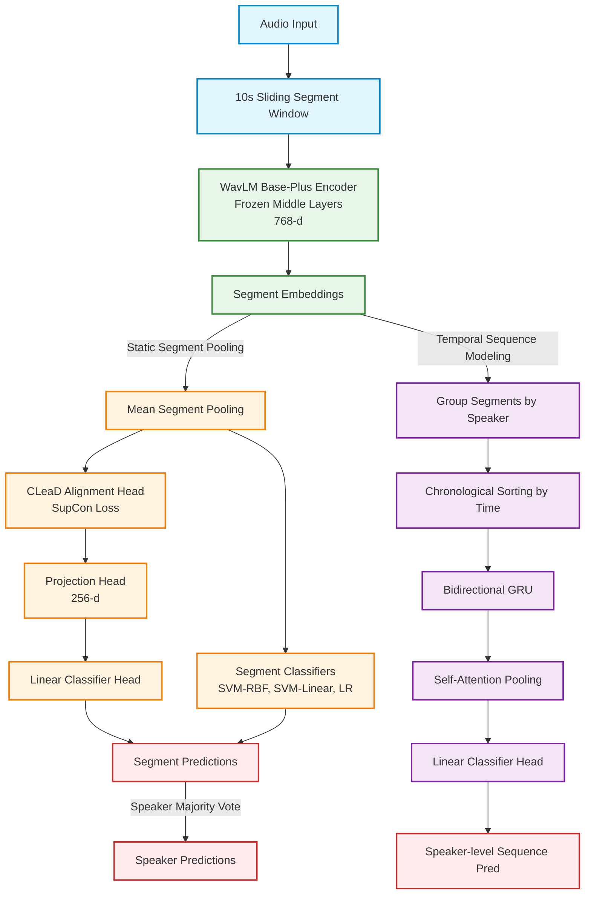

# Multi-Layer WavLM Ablation for Cross-Lingual Depression Detection: Contrastive Representation Alignment and Chronological Sequence Classifiers

This repository contains the codebase for cross-lingual zero-shot depression detection from speech, specifically targeting the transfer gap between Germanic (English) and Tonal (Mandarin) languages.

## Pipeline Structure



## Component Overview
1. **Feature Extractor:** We use `microsoft/wavlm-base-plus` (Layer 6) to extract robust, noise-augmented speech representations.
2. **CLeaD (Contrastive Alignment):** A dual-head architecture using Supervised Contrastive Loss (SupCon) to pull same-class representations together across English and Mandarin domains, mapping them to a shared clinical manifold.
3. **Non-Linear Classifier (SVM-RBF):** Radial Basis Function kernel SVM is applied to standardized segment embeddings to capture non-linear decision boundaries.
4. **Sequence Modeling (Bi-GRU):** Chronological sequence modeling groups segment embeddings per speaker and feeds them to a bidirectional GRU with self-attention pooling to capture temporal trajectories.

## Datasets
- **E-DAIC:** English corpus used for baseline training and evaluation.
- **MODMA:** Mandarin corpus used to validate zero-shot cross-lingual alignment.

## How to Run the Pipeline

### 1. Preprocessing
To segment the audio datasets into 10-second sliding windows and create the MIX dataset metadata:
```bash
# 1. Segment and split EDAIC
python3 code/preprocessing/segment_edaic_sliding.py
python3 code/preprocessing/split_metadata.py --input_csv data/utterance_table_edaic_segmented.csv

# 2. Segment and split MODMA
python3 code/preprocessing/segment_modma_sliding.py
python3 code/preprocessing/split_metadata.py --input_csv data/utterance_table_modma_segmented.csv

# 3. Combine them to create the MIX dataset metadata
python3 code/preprocessing/build_mixed_metadata.py
```

### 2. Feature Extraction
To extract the mean pooling features across multiple layers:
```bash
python3 code/feature_extraction/extract_ablation_features.py
```

### 3. Run Comprehensive Multi-Model Ablation Study
To train and evaluate LR, SVM-Linear, SVM-RBF, Bi-GRU, and CLeaD across all configurations and layers:
```bash
python3 code/classification/run_comprehensive_ablation.py
```

## Results

Below are the segment-level and speaker-level evaluation scores obtained from the comprehensive ablation run:

### 1. Segment-Level Metrics (WavLM Layer 6)
| Configuration | Model | Accuracy | F1 Score | ROC AUC |
| :--- | :--- | :---: | :---: | :---: |
| **EN -> EN** | LR | 71.47% | 0.6384 | 0.7849 |
|  | SVM-Linear | 72.30% | 0.6591 | 0.7956 |
|  | SVM-RBF | 68.54% | 0.5508 | 0.7252 |
|  | GRU | 69.57% | 0.5882 | 0.6667 |
|  | CLeaD | 70.70% | 0.6366 | 0.7751 |
| | | | | |
| **EN -> ZH** | LR | 49.79% | 0.2134 | 0.4997 |
|  | SVM-Linear | 49.46% | 0.2361 | 0.4841 |
|  | SVM-RBF | 49.00% | 0.2004 | 0.4954 |
|  | GRU | 50.00% | 0.5455 | 0.3600 |
|  | CLeaD | 49.08% | 0.3321 | 0.4695 |
| | | | | |
| **ZH -> EN** | LR | 56.32% | 0.4080 | 0.5775 |
|  | SVM-Linear | 57.10% | 0.4197 | 0.5915 |
|  | SVM-RBF | 55.17% | 0.3696 | 0.5757 |
|  | GRU | 60.87% | 0.1818 | 0.5784 |
|  | CLeaD | 60.91% | 0.5045 | 0.6477 |
| | | | | |
| **ZH -> ZH** | LR | 53.93% | 0.4633 | 0.5383 |
|  | SVM-Linear | 54.85% | 0.4760 | 0.5432 |
|  | SVM-RBF | 53.93% | 0.4558 | 0.5327 |
|  | GRU | 50.00% | 0.2857 | 0.4800 |
|  | CLeaD | 57.31% | 0.5152 | 0.5851 |
| | | | | |
| **MIX -> EN** | LR | 67.40% | 0.5673 | 0.7224 |
|  | SVM-Linear | 69.35% | 0.5963 | 0.7474 |
|  | SVM-RBF | 66.24% | 0.4816 | 0.6950 |
|  | GRU | 60.87% | 0.4000 | 0.5392 |
|  | CLeaD | 62.12% | 0.4911 | 0.6425 |
| | | | | |
| **MIX -> ZH** | LR | 51.55% | 0.4669 | 0.5033 |
|  | SVM-Linear | 52.46% | 0.4865 | 0.5153 |
|  | SVM-RBF | 52.21% | 0.4348 | 0.5365 |
|  | GRU | 60.00% | 0.3333 | 0.8000 |
|  | CLeaD | 52.80% | 0.4882 | 0.5210 |
| | | | | |

### 2. Speaker-Level Majority Vote Metrics (MODMA Test Set)
| Configuration | Model | MDD Correct | HC Correct | Speaker Acc |
| :--- | :--- | :---: | :---: | :---: |
| **ZH -> ZH** | LR | 2/5 | 5/5 | 70.00% |
|  | GRU | 1/5 | 4/5 | 50.00% |
|  | CLeaD | 3/5 | 4/5 | 70.00% |
| | | | | |
| **MIX -> ZH** | LR | 3/5 | 5/5 | 80.00% |
|  | GRU | 1/5 | 5/5 | 60.00% |
|  | CLeaD | 3/5 | 4/5 | 70.00% |
| | | | | |

### 3. WavLM Layer Ablation Study (MIX -> ZH Transfer)
| WavLM Layer | Model | Segment Accuracy | Segment F1 | Segment AUC | Speaker Vote (MDD/HC) |
| :---: | :--- | :---: | :---: | :---: | :--- |
| **Layer 6** | LR | 51.55% | 0.4669 | 0.5033 | 3/5 MDD, 5/5 HC |
|  | GRU | 60.00% | 0.3333 | 0.8000 | 1/5 MDD, 5/5 HC |
|  | CLeaD | 52.80% | 0.4882 | 0.5210 | 3/5 MDD, 4/5 HC |
| | | | | | |
| **Layer 7** | LR | 54.72% | 0.5311 | 0.5436 | 4/5 MDD, 5/5 HC |
|  | GRU | 70.00% | 0.5714 | 0.8000 | 2/5 MDD, 5/5 HC |
|  | CLeaD | 53.17% | 0.4860 | 0.5388 | 4/5 MDD, 4/5 HC |
| | | | | | |
| **Layer 8** | LR | 50.13% | 0.4726 | 0.5012 | 3/5 MDD, 4/5 HC |
|  | GRU | 70.00% | 0.5714 | 0.6000 | 2/5 MDD, 5/5 HC |
|  | CLeaD | 52.55% | 0.5614 | 0.5166 | 4/5 MDD, 3/5 HC |
| | | | | | |
| **Layer 9** | LR | 50.00% | 0.4591 | 0.4921 | 2/5 MDD, 4/5 HC |
|  | GRU | 70.00% | 0.7273 | 0.7200 | 4/5 MDD, 3/5 HC |
|  | CLeaD | 50.88% | 0.4545 | 0.5048 | 2/5 MDD, 4/5 HC |
| | | | | | |